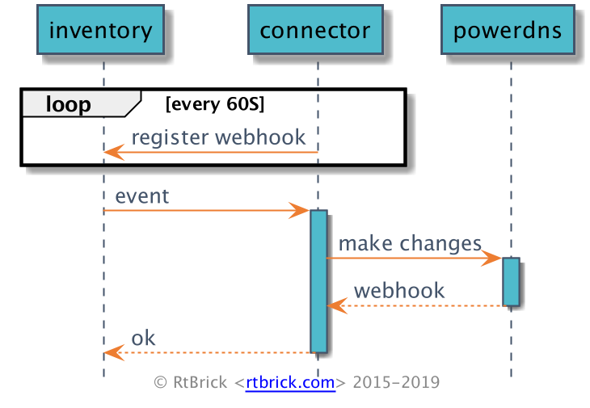

# Leitstand Powerdns Connector

This Project is the [powerdns](https://www.powerdns.com/) connector of the Leitstand project.
It connects the Leitstand inventory with powerdns. 

## TOC

<!-- ToC start -->
1. [Leitstand Powerdns Connector](#leitstand-powerdns-connector)
   1. [TOC](#toc)
   1. [Getting Started](#getting-started)
   1. [Build](#build)
   1. [Run](#run)
      1. [Configuration](#configuration)
   1. [Build docker](#build-docker)
   1. [Run docker](#run-docker)
<!-- ToC end -->

## Getting Started

This project is developed with the go language.

## Build

To build the project just use make.

```shell script
make
```

After the build the binary can be found in the build folder `bin`.
There is one subfolder for each platform.

## Run
```shell script
$ ./bin/darwin_amd64/connector  -help
Usage of ./bin/darwin_amd64/connector:
  -addr string
        HTTP network address (default ":19991")
  -config string
        Configuration for the powerdns connector (default "/etc/leitstand/connector/powerdns.json")
  -version
        Returns the software version
```

### Configuration

The Configuration file for the connector needs to specify the following data:

* **ExternalURL** The URL under which this service is externally reachable
(for example, if this services is served via a reverse proxy).
Used for generating relative and absolute links back to this service itself.
(e.g.: http://localhost:19991)
* **PowerdnsServerID** the id of the server, see https://doc.powerdns.com/authoritative/http-api/server.html
(e.g.: localhost)
* **PowerdnsBaseURL** the base url of the server (e.g.: http://localhost:8081)
* **PowerdnsAPIKey** the api key of powerdns (e.g.: changeme)
* **WebHookID** is used to register this service in the inventory as event listener.
This should not change, otherwise the service is registered twice.
(e.g. 52acd668-3171-45a3-b23a-05adc76dc809)
* **InventoyRestRestURL** the base url of the inventory server (e.g.: http://10.0.0.7:8080/api/v1)
* **InventoryAuthorizationHeader** the authorization header to call the webhook registration server (e.g.: Basic bWFydGluOmdlaGVpbQ==)

Example:

```json
{
  "external_url": "${external_url:http://localhost:19991}",
  "powerdns_server_id": "${powerdns_server_id:localhost}",
  "powerdns_base_url": "${powerdns_base_url:http://localhost:8081}",
  "powerdns_api_key": "${powerdns_api_key:changeme}",
  "inventory_rest_rest_url":"${inventory_rest_rest_url:http://10.0.0.7:8080/api/v1}",
  "web_hook_id": "${web_hook_id:52acd668-3171-45a3-b23a-05adc76dc809}",
  "inventory_authorization_header": "${inventory_authorization_header:Basic bWFydGluOmdlaGVpbQ==}"
}
```

The syntax `${<variable>:<defaultvalue>}` allows ot specify a environment variable and if that is not set a default value.
The default value can be omitted by just writing `${variable}`.

## Build docker

To build a docker container just use:

```shell script
make docker-build
``` 

## Run docker

To run a docker container just use:

```shell script
make docker-run
```

## Sequenz Diagram

The following sequence diagram gives a short overview of the connectors functionality.

## Swagger

Find the swagger files under the doc folder.

 

The connector registers every 60 seconds in the inventory.
If there is a change in an DNS record the inventory sends a notification to the connector.
The connector translates the changes and sends them to the powerdns web api.